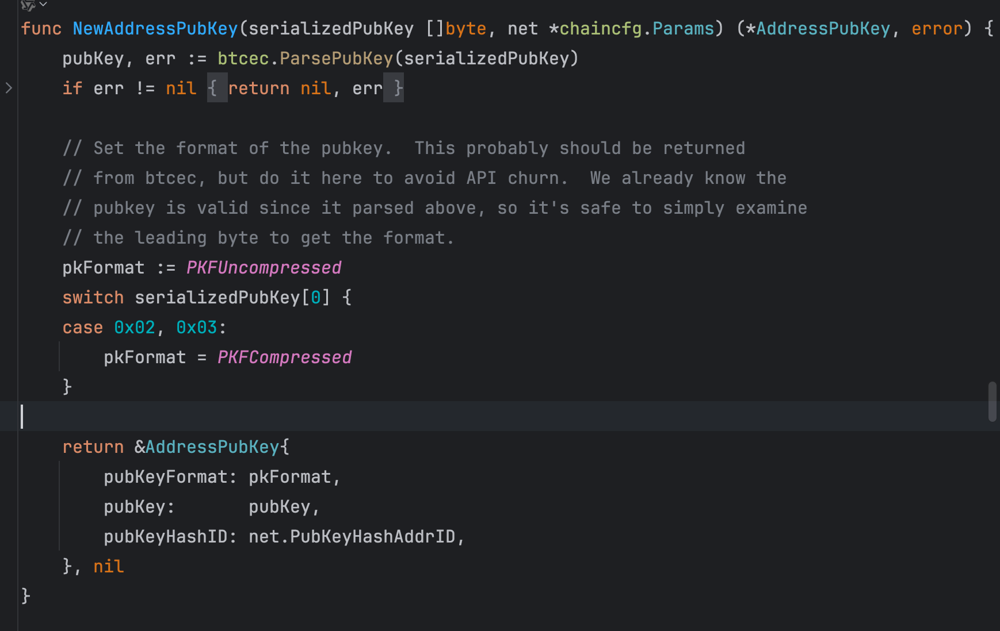
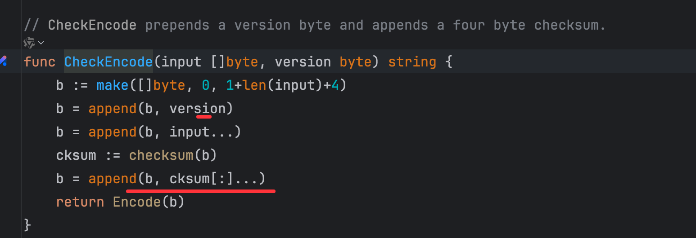

## bitcoin地址生成与解析
[膜拜大佬笔记](https://aandds.com/blog/bitcoin-key-addr.html#org0000001)

### p2pkh 推导过程



- 传入一个公钥解析，02，03开头的是压缩公钥，其他类型为非压缩公钥
- ripemd160(sha256(b)), 先将公钥进行sha256，再进行ripemd160

- 计算checksum, 主网PubKeyHashAddrID: 0x00,测试网:TestNetAddrID: 0x6f, 进行两次sha256，取前4位
```go
h := sha256.Sum256(input)
h2 := sha256.Sum256(h[:])
copy(cksum[:], h2[:4])
```
- [version + ripemd160_hash + checksum] 的切片数据，然后使用base58编码

